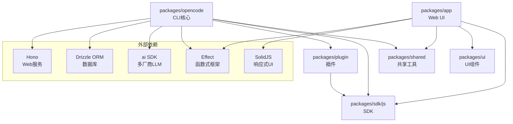

# OpenCode 架构与模块依赖

## 1. Monorepo 结构

```
opencode/
├── packages/
│   ├── opencode/          # CLI 核心（最大包）
│   ├── app/               # Web UI（SolidJS + Vite）
│   ├── sdk/js/            # JS/TS SDK
│   ├── plugin/            # 插件系统
│   ├── shared/            # 共享工具库
│   ├── ui/                # UI 组件库
│   ├── web/               # Web 相关
│   ├── console/           # 控制台应用
│   ├── desktop/           # Desktop 相关
│   ├── desktop-electron/  # Electron 桌面端
│   ├── docs/              # 文档
│   ├── function/          # 函数相关
│   ├── identity/          # 身份认证
│   ├── enterprise/        # 企业版
│   ├── extensions/        # 扩展
│   ├── containers/        # 容器相关
│   ├── slack/             # Slack 集成
│   └── storybook/         # Storybook
├── infra/                 # 基础设施（SST）
├── script/                # 构建脚本
├── patches/               # 依赖补丁
└── specs/                 # 规范文档
```

## 2. 核心包依赖关系



## 3. CLI 核心包内部架构

`packages/opencode/src/` 包含 ~50 个顶级目录，按职责分层：

### 3.1 用户交互层
```
src/cli/           # CLI 命令和界面
├── cmd/           # 各命令实现（run, serve, agent 等）
├── ui.ts          # 终端 UI 渲染
├── error.ts       # 错误格式化
└── bootstrap.ts   # 启动初始化

src/server/        # HTTP 服务
├── server.ts      # Hono 服务主入口
└── adapter.*.ts   # Bun/Node 适配器
```

### 3.2 核心逻辑层
```
src/agent/         # Agent 管理
├── agent.ts       # Agent 配置、选择、生成
└── prompt/        # 系统提示词模板

src/session/       # 会话管理
├── session.ts     # 会话 CRUD、消息流
├── message*.ts    # 消息模型
└── *.sql.ts       # 数据库表定义

src/tool/          # 工具系统
├── tool.ts        # 工具基础类型
├── registry.ts    # 工具注册表
├── bash.ts        # 执行命令
├── read.ts        # 读取文件
├── write.ts       # 写入文件
├── edit.ts        # 编辑文件
├── grep.ts        # 文本搜索
├── glob.ts        # 文件匹配
└── *.txt          # 工具提示词模板

src/project/       # 项目管理
├── project.ts     # 项目 CRUD
├── bootstrap.ts   # 服务启动初始化
├── instance.ts    # 实例管理
└── *.sql.ts       # 数据库表定义
```

### 3.3 基础设施层
```
src/effect/        # Effect 扩展
├── run-service.ts # 运行时封装
├── instance-state.ts # 实例状态管理
└── app-runtime.ts # 应用运行时

src/storage/       # 数据存储
├── db.*.ts        # 数据库连接（Bun/Node）
└── 各种 *.sql.ts   # 表定义

src/bus/           # 事件总线
├── bus-event.ts   # 事件定义
└── global.ts      # 全局事件总线

src/config/        # 配置管理
├── 各配置文件    # agent, auth, provider 等

src/provider/      # LLM 提供商
├── provider.ts    # 提供商管理
└── schema.ts      # 类型定义
```

## 4. 关键数据流

### 4.1 对话交互流
```
用户输入
  ↓
CLI (yargs routing)
  ↓
RunCommand (src/cli/cmd/run.ts)
  ↓
Session 创建/恢复
  ↓
Agent 选择 → 系统提示词组装
  ↓
LLM API 调用 (ai SDK)
  ↓
流式响应处理
  ↓
Tool 调用（如需要）→ 执行 → 结果返回
  ↓
消息保存 → SQLite
  ↓
输出到终端
```

### 4.2 项目启动流
```
CLI 启动
  ↓
数据库初始化（SQLite）
  ↓
Effect Layer 组装（所有 Service）
  ↓
InstanceState 初始化（按目录）
  ↓
各 Service init()（非阻塞 fork）
  ↓
进入命令处理循环
```

## 5. 数据库 Schema 概览

使用 Drizzle ORM + SQLite，主要表：

| 表 | 文件 | 用途 |
|----|------|------|
| **session** | `src/session/session.sql.ts` | 会话信息 |
| **part** | `src/session/session.sql.ts` | 消息片段 |
| **project** | `src/project/project.sql.ts` | 项目信息 |
| **worktree** | `src/worktree/` | 工作区 |
| ** Various others** | 其他 `*.sql.ts` | 配置、同步等 |

## 6. 构建与运行

### 6.1 开发命令
```bash
# 根目录
bun dev          # 启动 CLI dev 模式
bun dev:web      # 启动 Web dev 模式
bun dev:console  # 启动 Console dev 模式
bun typecheck    # 类型检查（turbo 并行）
bun lint         # 代码检查（oxlint）
```

### 6.2 包内命令
```bash
# packages/opencode
cd packages/opencode
bun run dev      # 启动 CLI
bun run typecheck # tsgo --noEmit
bun test         # 运行测试
bun run db       # Drizzle 数据库操作
```

## 7. 扩展点

| 扩展类型 | 位置 | 说明 |
|----------|------|------|
| **CLI 命令** | `src/cli/cmd/*.ts` | 新增 yargs 命令 |
| **工具** | `src/tool/*.ts` | 新增 AI 工具 |
| **Agent** | `src/agent/` | 新增 Agent 类型 |
| **插件** | `packages/plugin/` | 外部插件 SDK |
| **Provider** | `src/provider/` | 新增 LLM 提供商 |
